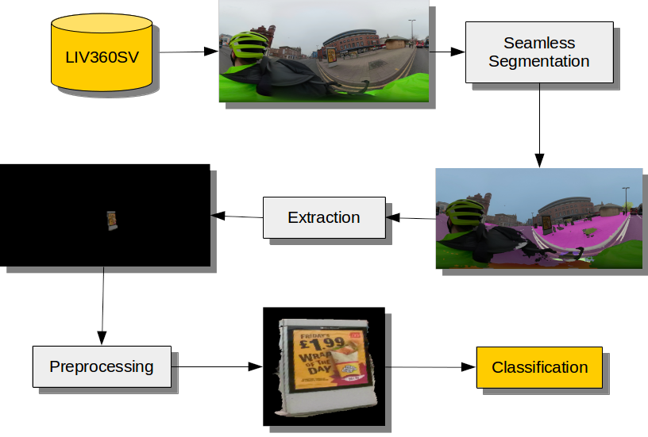

# LIV360SV 

We present a workflow for extracting and classifying advertisements located within street level images. We use a seamless scene segmentation network to identify regions within street-level images where advertisements are located. To subsequently classify the extracted advertisements we train a MobileNet-V2 to differentiate advertisement types using data scraped from Google Images. We introduce the Liverpool 360 Street View (LIV360SV) dataset for evaluating our workflow. The dataset contains 26,645, 360 degree, street-level images collected via cycling with a GoPro Fusion 360 camera.

## Data

## Workflow Components

### Seamless Scene Segmentation

For extracting advertisements from street level images we use the seamless scene segmentation network introduced by [Porzi et al. (2019)](https://arxiv.org/pdf/1905.01220.pdf). The network offers advantages of both semantic segmentation -- determining the semantic category that a pixel belongs to -- and instance-specific semantic segmentation -- the individual object that a pixel belongs to, enabling differentiation between neighbouring entities of the same type. The authors achieve state-of-the-art results on three street-view datasets, including Cityscapes \citep{Cordts2016Cityscapes}, the Indian Driving Dataset \citep{varma2019idd} and Mapillary Vistas \citep{MVD2017}. To install the seamless scene segmentation implementation visit:

https://github.com/mapillary/seamseg

### Extraction

Upon identifying the location of an advertisement, we obtain a one hot mask with a filled convex hull using OpenCV's find and draw contours functionalities \citep{itseez2015opencv}. The masks allow us to extract individual advertisements from the original input images. 

### Preprocessing

With the remaining content having been masked out during the extraction step we subsequently crop the images. However, given that the final step of our workflow is to pass the extracted items to a classifier trained on advertisement images with a frontal view, we use a Spatial Transformation Network (STN) \citep{jaderberg2015spatial} to transform the extracted items, the majority of which were recorded from a non-frontal view.  

### Classification

We classify extracted advertisements using Keras' MobileNet-V2~\citep{sandler2018mobilenetv2} implementation~\footnote{\url{https://keras.io/applications/#mobilenetv2}}. The network is trained using manually labelled extracted samples augmented with the scraped images dataset described in Section~\ref{sec:google_images_ds}. We train the network for five 1250 step epochs, using a learning rate of 1e-4 and a batch size of 32 images per step. The inputs images are of size 224x224 pixels. We apply common dataset augmentation techniques including random rotations and spatial transformations. We accelerate the training process using a GeForce GTX 1080 GPU. 

 
